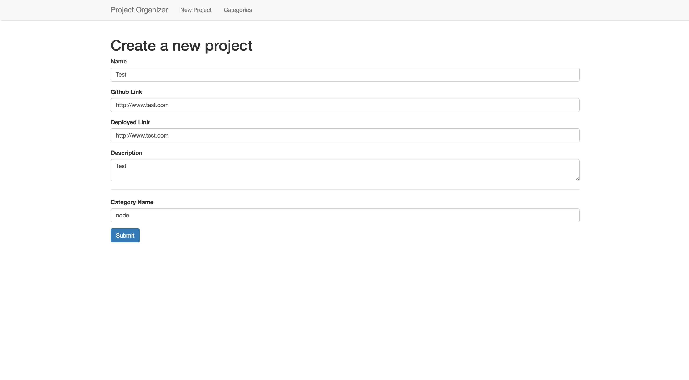
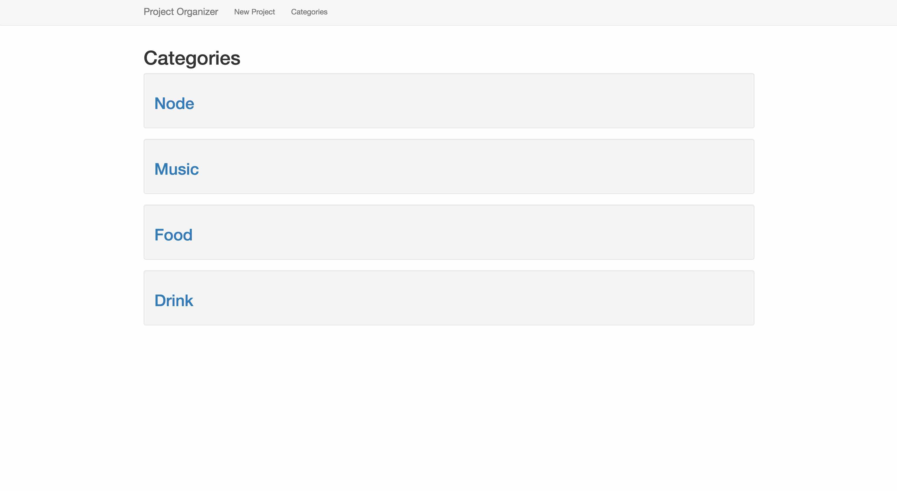
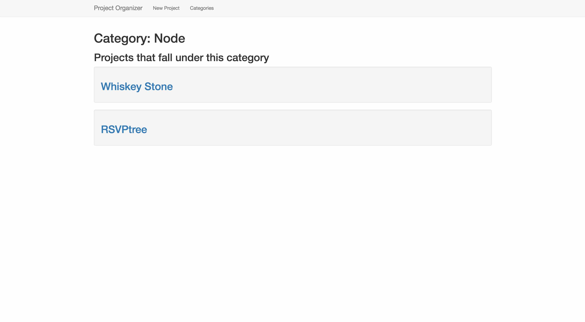

# Express Project Organizer

To practice N:M associations, we'll be adding the ability to categorize projects in an existing project organizer.

#### Backstory: Project Organizer

Keeping track of projects is a necessary part of peoples' personal lives and businesses. Another individual has created a project organizer that allows you to create and view projects, but it'd be nice to categorize projects. Let's add this functionality!

## Getting Started

We'll be using an existing application that includes one model, a few routes, and a few views.

* Fork and clone this repository
* Run `npm install` to install dependencies from the existing `package.json` file
  * Use `nodemon` to start your application
* Setup your database (this app already has one existing model)
  * Run `createdb project_organizer_development` to create the database
  * Run `sequelize db:migrate` to run migrations
  * Run `sequelize db:seed:all` to populate the database with 4 projects from previous Seattle cohorts.

#### Read the Code

After setup, **STOP**. You're using an existing application, so make sure to read the code and ensure what the application does. Here is some information about the current setup.

* Routes
  * `GET /` - home page that lists all projects
  * `POST /projects` - creates a new project, then redirects back to `GET /`
  * `GET /projects/new` - page that has a form for creating a new project
  * `GET /projects/:id` - page that shows a specific project
* Models
  * `project`
   * Attributes: `name`, `githubLink`, `deployedLink`, `description`

## User Stories

* As a user, I want to categorize projects using different names. For example, all of my Node projects will be under the category "Node".
* As a user, I want to assign multiple categories to a single project.
* As a user, I want to view a list of categories I've assigned.
* As a user, I want to view projects associated with a category I've selected.

## Requirements

#### Part 1: Create a Category model

In order to add categories, create a Sequelize model to store categories. It's recommended that you name this model `category`. It will store one attribute: the name of the category (a string).

Once this model has been created, run the migration for the model and test the model's functionality. This can be done in a separate file. An example:

**dbTest.js**

```js
var db = require('./models')

db.category.create({
  name: 'node'
}).then(function(category) {
  console.log(category.id)
})
```

#### Part 2: Create a Join model

In order to associate a category to many projects, and a project to many categories, we'll need to create an intermediate model. It's recommended that you name this model `categoriesProjects`. It will store two attributes: the id of a category (an integer) and the id of a project (an integer).

Once created, add the associations need to create a many-to-many association between categories and projects, using the join table you just created. Be sure to test this functionality by creating categories and projects, then seeing if you can include them in different queries.

```js
var db = require('./models')

db.project.findOne({
  where: { id: 1 },
  include: [db.category]
}).then(function(project) {
  // by using eager loading, the project model should have a categories key
  console.log(project.categories)

  // createCategory function should be available to this model - it will create the category then add it to the project
  project.createCategory({ name: 'node' }).then(function(category) {
    console.log(category.id)
  })
})
```

Note that these are two possible queries you can perform. There are others that you'll want to test.

#### Part 3: Integrate the model with the app

Now that the models have been created, you'll want to add the ability to create categories, view categories, and view projects by category to the rest of the application. Here is an approach you can take:

* Add a field to the existing view associated with `GET /projects/new`. This new field should accept a new category name. 
  * Keep in mind that categories should be associated with projects
  * Category names should be unique; the category model should have no duplicates (hint, use `findOrCreate`)
* Add to the view associated withe the `POST /projects` route, which allows the user to add categories to each individual project. 
* Create the following routes for viewing categories and viewing projects by category:
  * `GET /categories` - show all the categories that exist
  * `GET /categories/:id` - show a specific category and all the projects with that category

#### Part 4: Styling

When finished with the above, style the application appropriately with CSS. Try using a CSS framework you haven't used before, or a CSS syntax like [BEM](http://getbem.com/introduction/) or [OOCSS](https://www.smashingmagazine.com/2011/12/an-introduction-to-object-oriented-css-oocss/).

## Bonuses

* Add the ability to edit and delete projects
* Add the ability to input and assign multiple tags via a comma separated list.
  * Example: Inputting `node, pizza, music` would add all three tags to a project at once.
  * You'll notice that this will require multiple queries, dependent on how many tags you're adding. Look into using the [async module](https://wdi_sea.gitbooks.io/notes/content/02-js-jquery/js-async/readme.html) in order to run multiple asynchronous functions and send a response at the correct time.

## Deliverables

Here are some example screenshots. Your finished deliverable will differ and include the desired functionality.

#### New Project Page w/Categories



#### Categories Page



#### Categories Show Page



---

## Licensing
1. All content is licensed under a CC-BY-NC-SA 4.0 license.
2. All software code is licensed under GNU GPLv3. For commercial use or alternative licensing, please contact legal@ga.co.
